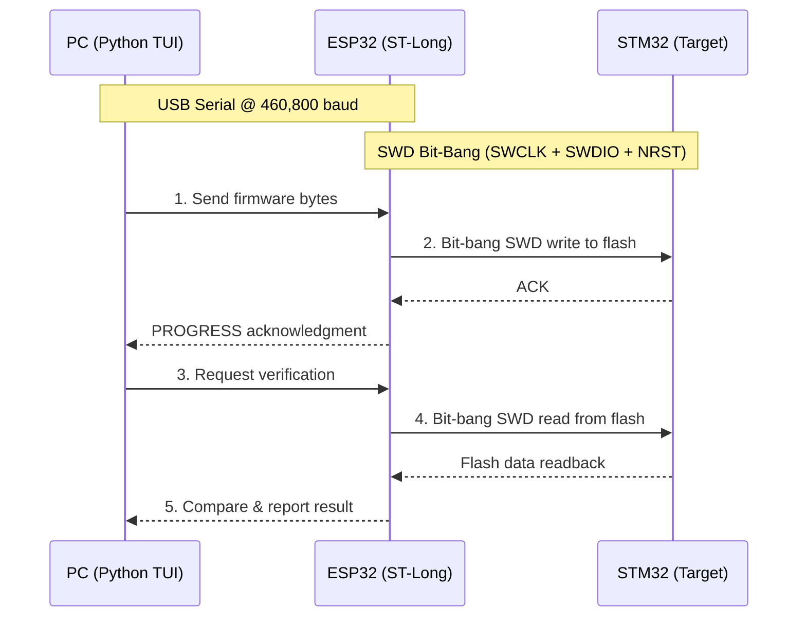
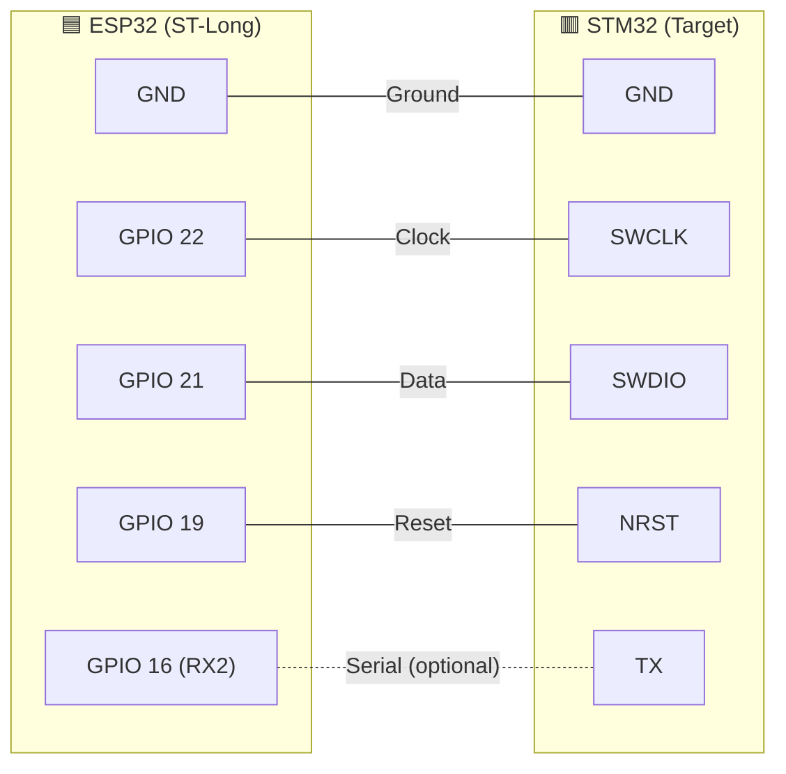

# MySalak STM32Duino Programmer

**ST-Long32** · Use Your ESP32 as an STM32 Programmer

[](#license)
[](https://www.espressif.com/en/products/socs/esp32)
[](https://www.st.com/en/microcontrollers-microprocessors/stm32u5-series.html)
[](https://github.com/Farras000)

---

## 💡 What Is This?

**You don't need a dedicated ST-Link or J-Link to program your STM32.**

This project proves that a **$3 ESP32 dev board** can serve as a fully functional **SWD (Serial Wire Debug) programmer** for STM32 microcontrollers. By implementing the ARM SWD protocol entirely through GPIO bit-banging on the ESP32, we eliminate the need for any specialized debug hardware.

The result is a fast, reliable, and cost-effective programmer that can:

- **Flash** firmware binaries to STM32 internal flash
- **Verify** the written data byte-for-byte
- **Erase** flash (mass erase or per-page)
- **Read** the target's IDCODE and debug registers
- **Bridge** the STM32's UART output to your PC for serial monitoring

All of this is wrapped in an interactive **Python Terminal UI** that makes the workflow as simple as selecting a menu option.

---

## ⚡ Key Features

| Feature | Description |
|:---|:---|
| **ESP32 as SWD Programmer** | No ST-Link required — the ESP32 bit-bangs the ARM SWD protocol directly via GPIO |
| **~3 MHz SWD Clock** | Compile-time unrolled NOP delays and direct register access achieve near-hardware speeds |
| **Block Transfers** | Hardware AP auto-increment streams data without per-word address overhead |
| **60 KB in ~4 seconds** | Full upload + verification cycle for a typical firmware binary |
| **460,800 Baud Serial** | High-speed UART between PC and ESP32 with chunk-based flow control |
| **Interactive Python TUI** | Menu-driven interface — no command-line flags to memorize |
| **Dual Programmer Support** | Switch between ST-Link and ST-Long32 (ESP32) from the same interface |
| **Arduino CLI Integration** | Build, upload, and scaffold STM32Duino sketches directly from the TUI |
| **100% Verification** | Chunked readback comparison ensures every byte is correct |

---

## 📐 How It Works



The ESP32 acts as a **bridge** between your PC and the STM32 target. The Python script on the PC sends firmware data over USB serial. The ESP32 receives it and writes it directly into the STM32's flash memory using the **ARM Serial Wire Debug (SWD)** protocol, implemented entirely through GPIO bit-banging.

---

## 🔌 Hardware Wiring

Both the ESP32 and STM32 operate at **3.3V** logic levels. **No level shifters are needed.** Connect them directly with jumper wires.

### Pinout

| ESP32 Pin | STM32 Pin | Function |
|:---|:---|:---|
| **GND** | **GND** | Common ground (required) |
| **GPIO 22** | **SWCLK** | SWD clock line |
| **GPIO 21** | **SWDIO** | SWD bidirectional data line |
| **GPIO 19** | **NRST** | Target reset (active low) |
| **GPIO 16 (RX2)** | **TX** | Optional: UART bridge for serial monitor |

### Wiring Diagram



---

## 🚀 Getting Started

### Prerequisites

- [PlatformIO](https://platformio.org/) (for building and flashing the ESP32 firmware)
- [Python 3.7+](https://www.python.org/)
- [Arduino CLI](https://arduino.github.io/arduino-cli/) (optional, for building STM32Duino sketches)

### Step 1: Flash the ESP32

```bash
# Clone the repository
git clone https://github.com/Farras000/bitbang.git
cd bitbang

# Build and upload to ESP32
pio run -t upload
```

### Step 2: Install Python Dependencies

```bash
pip install -r requirements.txt
```

### Step 3: Launch the Programmer

```bash
python programmer/main.py
```

The interactive TUI will guide you through everything — selecting a COM port, choosing a programmer, flashing firmware, and more.

---

## 🖥️ Interactive TUI

### Main Menu

```
╔══════════════════════════════════════════════════════╗
║            MySalak STM32Duino Programmer             ║
║                      ST-Long32                       ║
║                      Main Menu                       ║
╚══════════════════════════════════════════════════════╝

    1.  Use ST-Link Programmer
    2.  Use ST-Long Programmer (ESP32 Bridge)
    3.  List Sketches
    4.  Scaffold New Sketch
    5.  Build Sketch
    6.  Generate Build DB
    0.  Exit
```

### ST-Long Programmer Submenu

When you select **Option 2**, you'll be prompted to select a COM port, then enter the ST-Long submenu:

```
    1.  Build & Upload Sketch
    2.  Check connection to STM32
    3.  Upload firmware file
    4.  Upload & Verify
    5.  Read serial (STM32 UART output)
    6.  Erase flash
    0.  Back to Main Menu
```

---

## 📁 Project Structure

```
bitbang/
├── src/                        # ESP32 firmware (C++)
│   ├── main.cpp                # Entry point and serial bridge
│   ├── swd_bitbang.cpp         # Low-level SWD bit-bang protocol
│   ├── swd_dp.cpp              # Debug Port / Access Port operations
│   ├── stm32u5_flash.cpp       # STM32U5 flash controller driver
│   └── serial_cmd.cpp          # Command parser and data streaming
│
├── include/                    # C++ headers
│   └── pin_config.h            # GPIO pin assignments and tuning
│
├── programmer/                 # Python TUI application
│   ├── main.py                 # Main menu and program entry point
│   ├── menus.py                # Submenu handlers (connect, upload, erase, serial)
│   ├── upload.py               # Firmware upload and verification logic
│   ├── protocol.py             # Serial command protocol helpers
│   ├── sketch_utils.py         # Arduino CLI sketch build/scaffold helpers
│   ├── config.py               # Configuration constants (baud, chunk size, etc.)
│   ├── utils.py                # Banner, colors, and display utilities
│   └── bin/                    # Compiled .bin files (auto-populated after build)
│
├── platformio.ini              # PlatformIO build configuration
├── requirements.txt            # Python dependencies
└── README.md
```

---

## 🧠 Technical Deep Dive

The ESP32 firmware is a hand-optimized, bare-metal implementation of the ARM SWD protocol. Here's what makes it fast:

### SWD Bit-Banging (`swd_bitbang.cpp`)

Instead of relying on dedicated debug hardware, we emulate the SWD clock and data lines using ESP32 GPIO pins. Performance optimizations include:

- **Compile-time unrolled NOP templates** (`template<int N> swd_delay_nops()`) eliminate loop overhead, producing a stable ~3 MHz clock from raw assembly instructions.
- **Direct GPIO register writes** (`w1ts` / `w1tc`) bypass the Arduino `digitalWrite()` abstraction for instantaneous pin toggling.

### Pipelined AP Block Transfers (`swd_dp.cpp`)

The ARM debug interface supports auto-incrementing address transfers. We exploit this to stream data continuously:

- Write the target address to `AP_TAR` once, then burst-write data words to `AP_DRW`. The hardware increments the memory address automatically.
- The ARM spec mandates that auto-increment wraps at **1KB boundaries**. Our block transfer logic automatically detects boundary crossings, flushes the pipeline via `DP_RDBUFF`, updates `AP_TAR`, and re-primes the pipeline — all without losing a single byte.

### STM32U5 Flash Programming (`stm32u5_flash.cpp`)

The STM32U5 flash controller requires 128-bit (16-byte) quad-word writes. We use the SWD block-write feature to write 4 consecutive 32-bit words in a single burst, perfectly matching the flash controller's commit granularity.

### Flow-Controlled Serial Streaming (`serial_cmd.cpp`)

At 460,800 baud, data arrives faster than the ESP32 can write to flash. We solve this with:

- An expanded 8KB hardware RX buffer (`Serial.setRxBufferSize(8192)`)
- Strict 1024-byte chunk-based flow control with `PROGRESS:` acknowledgments, guaranteeing zero data loss without hardware RTS/CTS lines.

---

## 🛠️ Troubleshooting

| Problem | Solution |
|:---|:---|
| **Cannot open COM port** | Close PlatformIO Serial Monitor or any other app holding the port. Unplug and replug the ESP32. |
| **Connection failed** | Check wiring (especially GND). Ensure the 10kΩ pull-up is on SWDIO. Try power-cycling the STM32. |
| **Verification mismatches** | Shorten jumper wires. Increase `SWD_DELAY_CYCLES` in `pin_config.h` from `8` to `20` to slow the clock. |
| **Flash write fails** | The STM32 may be read-out protected. The script auto-unlocks flash, but deep RDP levels may require a mass erase. |
| **Slow upload speed** | Ensure `SERIAL_BAUD` in `pin_config.h` and `BAUD` in `config.py` are both set to `460800`. |

---

## 👤 Author

**Farras000** — [github.com/Farras000](https://github.com/Farras000)

---

## 📄 License

This project is open source. See the [LICENSE](LICENSE) file for details.
